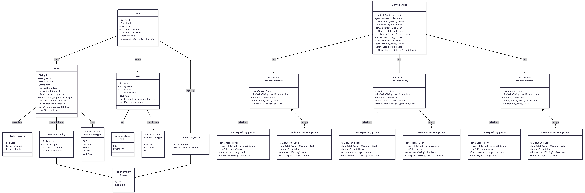
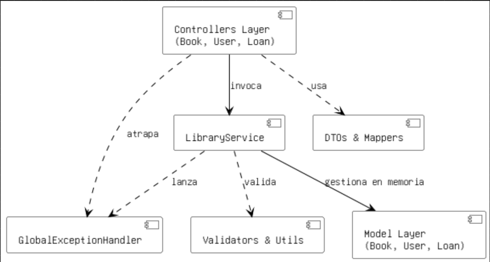
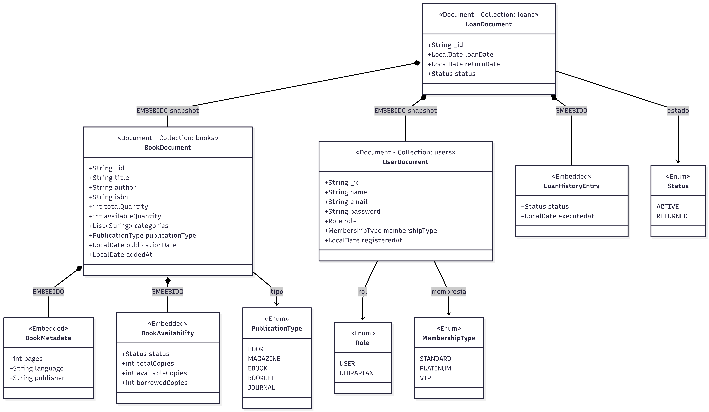
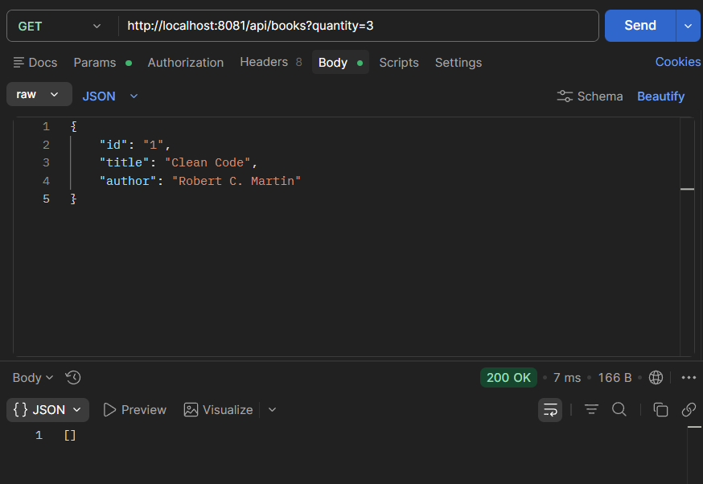
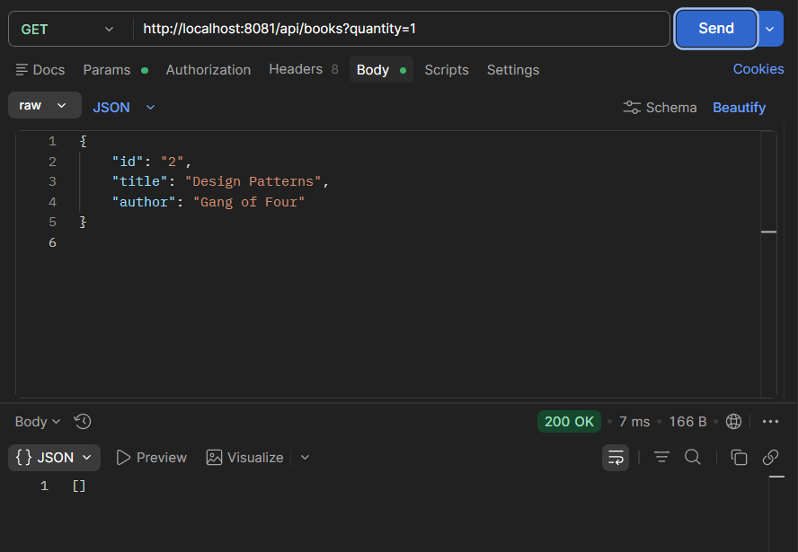
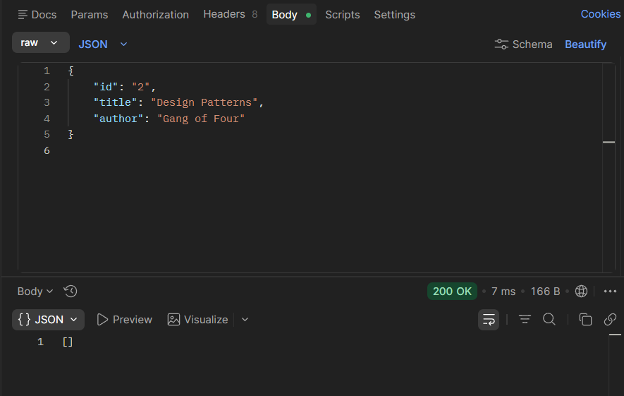
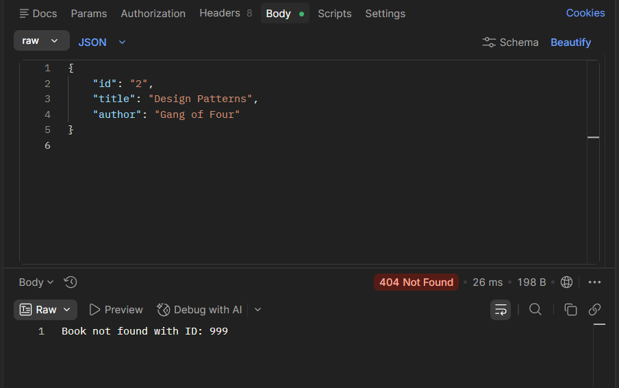
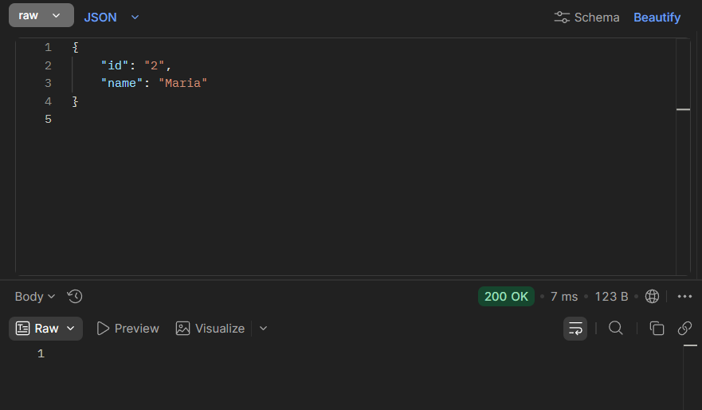
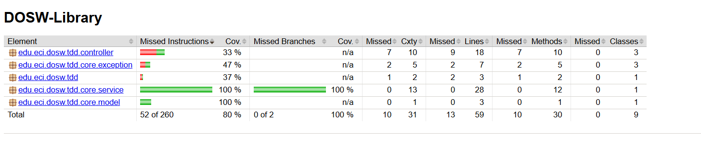
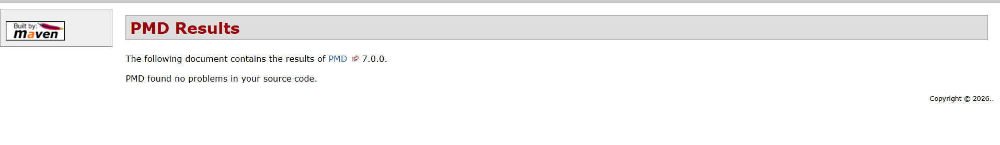

# DOSW Library API - Laboratorio Semana 8

Este repositorio contiene la implementación del sistema de gestión de bibliotecas para DOSW Company. El proyecto fue desarrollado utilizando Spring Boot e incluye la capa de controladores, servicios y modelos para manejar libros, usuarios y préstamos.

## 1. Diagramas Arquitectónicos

A continuación, se presentan los diagramas que modelan la solución, mejorados y digitalizados:

### Diagrama de Clases

### Diagrama de Componentes

### Diagrama de Flujo - Modelo NoSQL

---

## 2. Ejecución de las Funcionalidades (API)

Evidencia del funcionamiento de los endpoints de la API REST:

### Creación y Consulta de Libros y Usuarios

---

## 3. Pruebas Unitarias

Ejecución exitosa de los escenarios de prueba cubriendo casos de éxito y de error para los servicios de la biblioteca:

---

## 4. Análisis de Calidad de Código

Resultados del análisis de cobertura y estático del proyecto:

### Cobertura de Pruebas (JaCoCo)

### Análisis Estático

