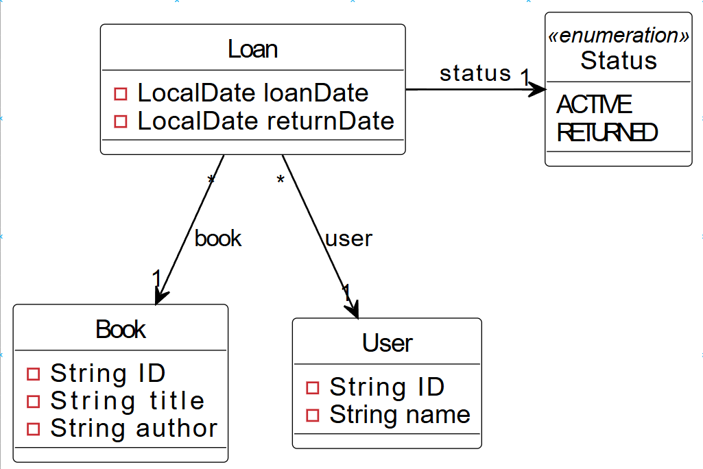
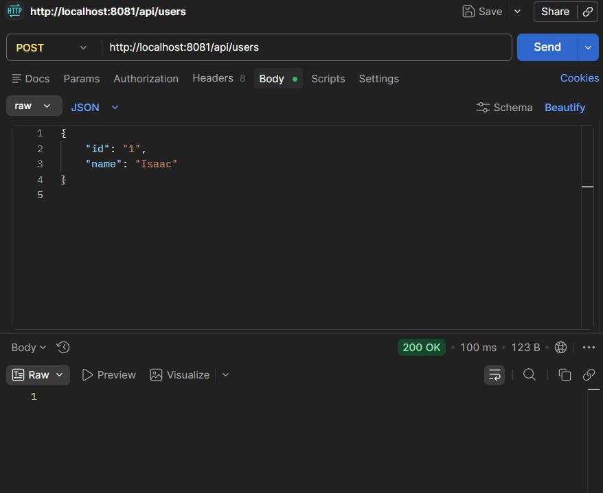
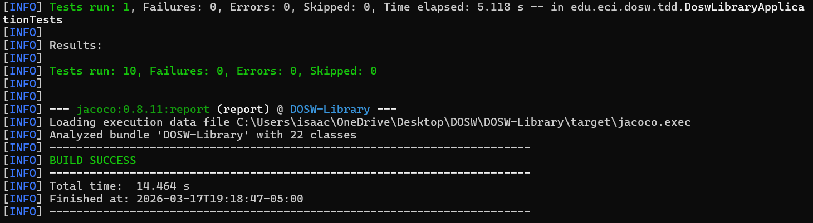

# DOSW Library API - Laboratorio Semana 8

Este repositorio contiene la implementación del sistema de gestión de bibliotecas para DOSW Company. El proyecto fue desarrollado utilizando Spring Boot e incluye la capa de controladores, servicios y modelos para manejar libros, usuarios y préstamos.

## 1. Diagramas Arquitectónicos

A continuación, se presentan los diagramas que modelan la solución, mejorados y digitalizados:

### Diagrama de Clases

![Diagrama de Clases de la Biblioteca]

### Diagrama de Componentes

![Diagrama de Componentes Especifico]

---

## 2. Ejecución de las Funcionalidades (API)

Evidencia del funcionamiento de los endpoints de la API REST :

### Creación y Consulta de Libros y Usuarios

![Evidencia API Libros y Usuarios]

--

## 3. Pruebas Unitarias

Ejecución exitosa de los escenarios de prueba cubriendo casos de éxito y de error para los servicios de la biblioteca 43, 52]:

![Ejecución de Pruebas JUnit]

---

## 4. Análisis de Calidad de Código

Resultados del análisis de cobertura y estático del proyecto

### Cobertura de Pruebas (JaCoCo)

![Reporte de Cobertura]

### Análisis Estático

![Reporte de Análisis Estático]
